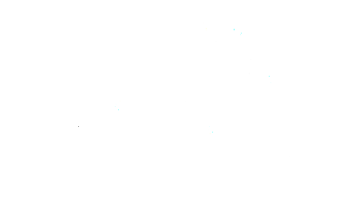

# Systems

A **system** is a set of interconnected components gathered to create a specific function.  
A system has **boundaries**, and the function it generates is the interaction of the system with other sets of systems, which we group as the **environment**.

---

## Dynamical Systems

Assume that we have a set of variables representing the variables in the system.  
When we know the values of these variables, we can understand the current situation of the system.

Let **x** represent the **state of the system**.  
In a dynamical system, states are **evolving with time**:

$$
x = x(t)
$$

A **mathematical representation of a physical system** (a mathematical abstraction) can be:

- An **$n^{th}$-order differential equation**, or  
- A **first-order differential equation** in continuous time.

---

### Example 1

{: .center-image }

**Question:** Explain the relationship between $x$ and $\dot{x}$ represent the relationship with a graph and investigate their harmony assuming no externall energy loss.

$$
\dot{x}(t) = \frac{d}{dt}x(t)
$$

Here:

- $x(t)$ is the state (position on the system trajectory at time $t$).  
- $\dot{x}(t)$ is the **rate of change** (derivative) of the state at time $t$.

---

### Solution

The equation of motion is:

$$
m\ddot{x}(t) + k x(t) = 0
$$


$$
x(t) = A\cos(\omega t + \phi),\qquad \omega=\sqrt{\frac{k}{m}}
$$

so the velocity is

$$
\dot{x}(t) = -A\omega\sin(\omega t + \phi)
$$


Define the state vector  

$$
\mathbf{x} = \begin{bmatrix} x_1 \\ x_2 \end{bmatrix} = \begin{bmatrix} x \\ \dot{x} \end{bmatrix}
$$


The first-order state equations are

$$
\dot{\mathbf{x}} =
\begin{bmatrix} 0 & 1 \\ -\frac{k}{m} & 0 \end{bmatrix} \mathbf{x}
$$

---

### Phase-space (ellipse) relation — eliminate time

Eliminating time between $x(t)$ and $\dot{x}(t)$ gives the phase-space equation (an ellipse):

$$
\left(\frac{x}{A}\right)^2 + \left(\frac{\dot{x}}{A\omega}\right)^2 = 1
$$

or equivalently

$$
\frac{x^2}{A^2} + \frac{\dot{x}^2}{A^2\omega^2} = 1
$$

So the trajectory in the $(x,\dot{x})$ plane is an ellipse with semi-axes $A$ (in $x$) and $A\omega$ (in $\dot{x}$).

In Python it is possible the print the graph of the relationship.

<div class="code-example" markdown="1">
```
import numpy as np
import matplotlib.pyplot as plt
from scipy.integrate import solve_ivp

# System parameters
m = 5.0
k = 5.0

# ODE definition
def mass_spring_ode(t, x):
    return [x[1], -k/m * x[0]]

# Initial conditions
x0 = [1.0, 0.0]

# Time span
t_span = (0, 10)
t_eval = np.linspace(*t_span, 1000)

# Solve ODE
sol = solve_ivp(mass_spring_ode, t_span, x0, t_eval=t_eval)

# Phase plot: velocity vs position
plt.figure(figsize=(6,6))
plt.plot(sol.y[0], sol.y[1])
plt.title('Phase Plot: Velocity vs Position')
plt.xlabel('Position x (m)')
plt.ylabel('Velocity x_dot (m/s)')
plt.grid(True)
plt.axis('equal')  # Equal scaling for x and velocity axes
plt.show()

```
</div>
You can run this code on colab or in your system and see the graph yourself with the link below

[Google Colab](https://colab.research.google.com/drive/1rLBo-HZK1qPt1uaRpGjEiboePzT3KTo2?usp=sharing)

if there was a damping element connected to mass parallel to the spring the result would be :

<div class="code-example" markdown="1">
```
import numpy as np
import matplotlib.pyplot as plt
from scipy.integrate import solve_ivp

# System parameters
m = 5.0    # mass (kg)
k = 5.0    # spring constant (N/m)
c = 0.5    # damping coefficient (N·s/m)

# ODE definition with damping
def damped_mass_spring_ode(t, x):
    dxdt = [x[1], -k/m * x[0] - c/m * x[1]]
    return dxdt

# Initial conditions: x=1 m, velocity=0 m/s
x0 = [1.0, 0.0]

# Time span
t_span = (0, 100)
t_eval = np.linspace(*t_span, 1000)

# Solve ODE
sol = solve_ivp(damped_mass_spring_ode, t_span, x0, t_eval=t_eval)

# Phase plot: velocity vs position
plt.figure(figsize=(6,6))
plt.plot(sol.y[0], sol.y[1])
plt.title('Phase Plot: Damped Mass-Spring System')
plt.xlabel('Position x (m)')
plt.ylabel('Velocity x_dot (m/s)')
plt.grid(True)
plt.axis('equal')
plt.show()

# Optional: plot x and x_dot over time
plt.figure(figsize=(10,5))
plt.plot(sol.t, sol.y[0], label='Position x (m)')
plt.plot(sol.t, sol.y[1], label='Velocity x_dot (m/s)')
plt.title('Damped Mass-Spring System Over')

```
</div>
You can run this code on colab or in your system and see the graph yourself with the link below

[Google Colab](https://colab.research.google.com/drive/1DYkDLpfLnn-MFEUAyRlsV7SKDzE4oDRB?usp=sharing)


