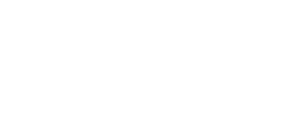
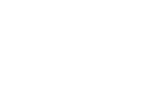

# Mechanical Systems

Mechanical systems can be divided into two main types:

- **Translational systems**  
  - **Effort variable:** Force ($F$)  
  - **Flow variable:** Velocity ($v = \dot{x}$)  
  - Other related quantities: displacement ($x$), acceleration ($a = \ddot{x}$), mass ($m$), spring constant ($k$), and damping/friction coefficient ($b$)

- **Rotational systems**  
  - **Effort variable:** Torque ($\tau$)  
  - **Flow variable:** Angular velocity ($\omega = \dot{\theta}$)  
  - Other related quantities: angular displacement ($\theta$), angular acceleration ($\alpha = \ddot{\theta}$), rotational inertia ($J$), torsional spring constant, and rotational damping

---

## Modeling of Dynamical Systems

In modeling dynamical systems, the **selection of variables** may vary depending on the modeling approach.  
However, for physical interpretability, we typically focus on **work-related variables** — the effort and flow variables — in each physical domain.

In any physical domain, there are two main types of variables:

1. A **flow variable**, related to the rate of energy or mass transfer (e.g., velocity, current, volumetric flow).  
2. An **effort variable**, representing the driving cause of that flow (e.g., force, voltage, pressure).

The instantaneous **power** in the domain is the product of effort and flow, and the **work** done is their integral:

$$
P = \text{Effort} \times \text{Flow}
$$

$$
W = \int P\,dt = \int (\text{Effort} \times \text{Flow})\,dt
$$

---

## Work and Energy

External work is given by:

$$
W = F \cdot d
$$

where  

- $F$ is the force  
- $d$ is the displacement  

For a mass element (kinetic energy storage):

$$
F = m a = m \ddot{x}
$$

---

## D’Alembert’s Principle

According to **D’Alembert’s Principle**, in a dynamical system, the inertia force is treated as a reaction force.  
Thus, instead of $\sum F = m a$, we write:

$$
\sum F - m a = 0
$$

or equivalently,

$$
\sum F = 0
$$

This allows dynamic systems to be analyzed using equilibrium concepts.

---

## Momentum and Energy Storage

- **Linear momentum**

$$
\vec{p} = m \vec{v}
$$

- **Kinetic energy storage (mass)**

$$
E_k = \frac{1}{2} m v^2
$$

---

## Potential Energy Storage (Spring)

A **spring** stores energy by opposing deformation.  
When one end of the spring is displaced relative to the other, the spring exerts a **restoring force** proportional to the relative displacement.

{: .align-center}

For a linear spring with stiffness $k$, connected between two points with displacements $x_1$ and $x_2$, the spring force is given by:

$$
F = k(x_1 - x_2)
$$

This force acts to **oppose the relative motion** between the two ends —  
the spring *pulls back* when stretched and *pushes back* when compressed.

The **potential energy** stored in the spring is:

$$
E_p = \frac{1}{2} k (x_1 - x_2)^2
$$

This stored energy can later be released as mechanical work, converting potential energy back into kinetic or other forms.

---

## Power Dissipation (Friction and Damping)

Mechanical systems also include **energy-dissipating elements** such as dampers and frictional surfaces.  
These elements convert mechanical energy into heat, preventing perpetual oscillations and stabilizing the system.

---

### 1. Viscous Friction (Viscous Damping)

**Viscous friction** occurs when a resistive force is proportional to the **relative velocity** between two moving surfaces.  
It models fluid-like resistance (such as air drag, oil, or grease) and is **linear** with respect to velocity.

The force–velocity relationship is:

$$
F = b (\dot{x}_1 - \dot{x}_2)
$$

where  

- $b$ is the **viscous damping coefficient** (N·s/m),  
- $(\dot{x}_1 - \dot{x}_2)$ is the **relative velocity**.

The **power dissipated** by the viscous damper is:

$$
P = F v = b v^2
$$

Viscous friction is **velocity-dependent**, producing a smooth and continuous resistive force that always opposes motion.

{: .align-center}

---

### 2. Coulomb (Dry) Friction

**Coulomb friction**, also known as **dry friction**, occurs between two solid surfaces in contact.  
Unlike viscous friction, it is **independent of velocity magnitude** and depends only on the **direction of motion**.

The friction force is given by:

$$
F_f = F_c \, \mathrm{sgn}(v)
$$

where  

- $F_c$ is the **Coulomb friction constant** (the limiting friction force),  
- $\mathrm{sgn}(v)$ is the **sign function**, equal to $+1$ when $v>0$ and $-1$ when $v<0$.

When the body is stationary ($v = 0$), **static friction** applies:

$$
|F_s| \leq F_c
$$

Coulomb friction always **opposes motion** and causes **nonlinear energy dissipation**.  
Because it changes sign abruptly at zero velocity, it introduces **discontinuities** in system dynamics, often resulting in **stick-slip motion**.

---