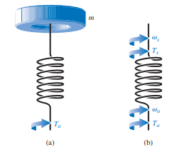

# Conventional Methods for Analyzing Mechanical Systems

Mechanical systems can be analyzed using two main approaches:

1. **Conventional (Newtonian) Methods** — based on direct application of Newton’s laws.  
2. **Analytical (Lagrangian or Hamiltonian) Methods** — based on energy relations.

This lecture introduces the **conventional force-based approach** and transitions into the **Lagrangian formulation**.

---

## Conventional Method (Force-Based Analysis)

When analyzing a mechanical system composed of multiple components, we proceed as follows:

1. **Analyze the number of bodies**  
2. **Isolate the components**  
3. **Place the force vectors**  
4. **Include external forces**  
5. **Apply the governing equations**  

- Static system:

$$
\sum F = 0
$$

- Dynamic system:

$$
\sum F = m \ddot{q}(t)
$$

- Rotational system:

$$
\sum \tau = J \ddot{q}_\theta(t)
$$

---

## Lagrangian Formulation

Lagrangian:

$$
L = T - V
$$

Generalized coordinates \(q_i\), velocities \(\dot{q}_i\), generalized forces \(Q_i\):

$$
\delta W = \sum_i Q_i \delta q_i
$$

Lagrange’s equation:

$$
\frac{d}{dt} \left( \frac{\partial L}{\partial \dot{q}_i} \right) - \frac{\partial L}{\partial q_i} = Q_i
$$

---

## Example 1 — Translational Mass–Spring System

{: .center-image }

- Generalized coordinate: \(q\)  
- Kinetic energy: \(T = \frac{1}{2} m \dot{q}^2\)  
- Potential energy: \(V = \frac{1}{2} k q^2\)  

Lagrangian:

$$
L = \frac{1}{2} m \dot{q}^2 - \frac{1}{2} k q^2
$$

Equation of motion:

$$
m \ddot{q} + k q = 0
$$

Solution:

$$
q(t) = A \cos(\omega t + \phi), \quad \omega = \sqrt{\frac{k}{m}}
$$

---

## 4. Example 2 — Torsional (Rotational) Spring–Inertia System

Consider a rigid disk of **moment of inertia \(J\)** connected to a **torsional spring of stiffness \(k_\theta\)**.  
Let the **generalized angular coordinate** be \(q_\theta\) (angular displacement).

### Step 1 — Generalized coordinate

$$
q_\theta = \theta
$$

### Step 2 — Express energies

- Kinetic energy (rotational):

$$
T = \frac{1}{2} J \dot{q}_\theta^2
$$

- Potential energy (torsional spring):

$$
V = \frac{1}{2} k_\theta q_\theta^2
$$

---

### Step 3: Form the Lagrangian

The Lagrangian ($L$) is defined as the kinetic energy ($T$) minus the potential energy ($V$).

$$
L = T - V = \frac{1}{2} J \dot{q}_\theta^2 - \frac{1}{2} k_\theta q_\theta^2
$$

---

### Step 4: Apply Lagrange’s Equation

The equation of motion is found using Lagrange's equation for a conservative system:

$$
\frac{d}{dt} \left( \frac{\partial L}{\partial \dot{q}_\theta} \right) - \frac{\partial L}{\partial q_\theta} = 0
$$

#### **Computing the Terms**

First, we find the partial derivatives of the Lagrangian:

$$
\frac{\partial L}{\partial \dot{q}_\theta} = J \dot{q}_\theta
$$

$$
\frac{\partial L}{\partial q_\theta} = -k_\theta q_\theta
$$

Next, we take the time derivative of the first term:

$$
\frac{d}{dt} \left( \frac{\partial L}{\partial \dot{q}_\theta} \right) = \frac{d}{dt} (J \dot{q}_\theta) = J \ddot{q}_\theta
$$

#### **Equation of Motion**

Substituting these results back into Lagrange's equation gives the equation of motion:

$$
J \ddot{q}_\theta - (-k_\theta q_\theta) = 0
$$

$$
J \ddot{q}_\theta + k_\theta q_\theta = 0
$$

---

### Step 5: Write the Solution

This is the standard differential equation for simple harmonic motion. The general solution for the angular position $q_\theta(t)$ is:

$$
q_\theta(t) = A \cos(\omega_\theta t + \phi)
$$

The natural frequency of oscillation, $\omega_\theta$, is given by:

$$
\omega_\theta = \sqrt{\frac{k_\theta}{J}}
$$