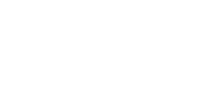

# Conventional Methods for Analyzing Mechanical Systems

Mechanical systems can be analyzed using two main approaches:

1.  **Conventional (Newtonian) Methods** — Based on the direct application of Newton’s laws of motion.
2.  **Analytical (Lagrangian or Hamiltonian) Methods** — Based on the system's kinetic and potential energy.

This lecture introduces the conventional force-based approach and then demonstrates the more powerful Lagrangian formulation.

---

## Conventional Method (Force-Based Analysis)

When analyzing a mechanical system using Newtonian methods, the typical procedure is:

1.  **Isolate each body** in the system to create free-body diagrams.
2.  **Draw all force vectors** acting on each body, including applied forces, reaction forces, and inertial forces.
3.  **Apply the governing equations of motion** for each body.

* **Static System** ($\sum \mathbf{F} = 0$):
    $$
    \sum F = 0
    $$

* **Dynamic Translational System**:
    $$
    \sum F = m \ddot{q}(t)
    $$

* **Dynamic Rotational System**:
    $$
    \sum \tau = J \ddot{q}_\theta(t)
    $$

---

## The Lagrangian Formulation

The Lagrangian method is an energy-based approach that simplifies finding the equations of motion, especially for complex systems.

The **Lagrangian ($L$)** of a system is defined as the difference between its total kinetic energy ($T$) and total potential energy ($V$).
$$
L = T - V
$$
The system's state is described by a set of independent **generalized coordinates** ($q_i$). The equations of motion are found using **Lagrange’s equation**:

$$
\frac{d}{dt} \left( \frac{\partial L}{\partial \dot{q}_i} \right) - \frac{\partial L}{\partial q_i} = Q_i
$$

Here, $\dot{q}_i$ are the generalized velocities and $Q_i$ are the non-conservative generalized forces (like friction or external driving forces).

---

## Example 1: Translational Mass–Spring System

{: .center-image }

* **Generalized Coordinate**: The displacement of the mass, $q$.
* **Kinetic Energy**: $T = \frac{1}{2} m \dot{q}^2$
* **Potential Energy**: $V = \frac{1}{2} k q^2$

The **Lagrangian** is:
$$
L = T - V = \frac{1}{2} m \dot{q}^2 - \frac{1}{2} k q^2
$$
Applying Lagrange's equation for the coordinate $q$ yields the **equation of motion**:
$$
m \ddot{q} + k q = 0
$$
The **solution** describes simple harmonic motion:
$$
q(t) = A \cos(\omega t + \phi), \quad \text{where} \quad \omega = \sqrt{\frac{k}{m}}
$$

---