# Complete Guide to Spatialmath-Python and Roboticstoolbox-Python

This notebook provides a comprehensive guide to working with spatial mathematics and robotics using Python. It covers:
- Basic spatial mathematics operations
- Transforms and rotations
- Robot modeling and kinematics
- Trajectory planning with visualization
- 3D visualization

**Author:** Ahmed Numan Pervane - IKCU|EMS LAB   
**Last Updated:** September 2025

## 1. Installation and Setup

First, install the required libraries. This may take a few minutes.


```python
# Install required packages
!pip install spatialmath-python roboticstoolbox-python matplotlib scipy -q
!pip install numpy==1.26.4 # You must restart the session after that code block proceed. Then you may continue to run below code blocks

print("✓ Installation complete!")
```


```python
# Import libraries
import numpy as np
import matplotlib.pyplot as plt
from spatialmath import SE3, SO3, UnitQuaternion
from spatialmath.base import *
import roboticstoolbox as rtb
from roboticstoolbox import DHRobot, RevoluteDH, PrismaticDH
from math import pi

# Set up plotting
%matplotlib inline
plt.rcParams['figure.figsize'] = (10, 8)

print("✓ Libraries imported successfully!")
```


## 2. Basic Spatial Mathematics Operations

Let's explore fundamental spatial math concepts including rotation matrices, translation vectors, and homogeneous transformations.

### 2.1 Rotation Matrices


```python
# Create rotation matrices around different axes
R_x = rotx(45, unit='deg')  # Rotate 45° around X-axis
R_y = roty(30, unit='deg')  # Rotate 30° around Y-axis
R_z = rotz(60, unit='deg')  # Rotate 60° around Z-axis

print("Rotation around X-axis (45°):")
print(R_x)
print("\nRotation around Y-axis (30°):")
print(R_y)
print("\nRotation around Z-axis (60°):")
print(R_z)

# Combine rotations
R_combined = R_z @ R_y @ R_x
print("\nCombined rotation (Z*Y*X):")
print(R_combined)
```

    Rotation around X-axis (45°):
    [[ 1.          0.          0.        ]
     [ 0.          0.70710678 -0.70710678]
     [ 0.          0.70710678  0.70710678]]
    
    Rotation around Y-axis (30°):
    [[ 0.8660254  0.         0.5      ]
     [ 0.         1.         0.       ]
     [-0.5        0.         0.8660254]]
    
    Rotation around Z-axis (60°):
    [[ 0.5       -0.8660254  0.       ]
     [ 0.8660254  0.5        0.       ]
     [ 0.         0.         1.       ]]
    
    Combined rotation (Z*Y*X):
    [[ 0.4330127  -0.43559574  0.78914913]
     [ 0.75        0.65973961 -0.04736717]
     [-0.5         0.61237244  0.61237244]]


### 2.2 Using SO3 Class for Rotations


```python
# Create SO3 rotation objects
R1 = SO3.Rx(45, unit='deg')
R2 = SO3.Ry(30, unit='deg')
R3 = SO3.Rz(60, unit='deg')

print("SO3 Rotation object:")
print(R1)

# Access the rotation matrix
print("\nRotation matrix:")
print(R1.R)

# Convert to different representations
print("\nRoll-Pitch-Yaw angles (degrees):")
print(R1.rpy(unit='deg'))

print("\nEuler angles ZYX (degrees):")
print(R1.eul(unit='deg'))
```

    SO3 Rotation object:
       1         0         0         
       0         0.7071   -0.7071    
       0         0.7071    0.7071    
    
    
    Rotation matrix:
    [[ 1.          0.          0.        ]
     [ 0.          0.70710678 -0.70710678]
     [ 0.          0.70710678  0.70710678]]
    
    Roll-Pitch-Yaw angles (degrees):
    [45. -0.  0.]
    
    Euler angles ZYX (degrees):
    [-90.  45.  90.]


### 2.3 Unit Quaternions


```python
# Create quaternions
q1 = UnitQuaternion.Rx(45, unit='deg')
q2 = UnitQuaternion.Ry(30, unit='deg')

print("Quaternion for 45° rotation around X:")
print(q1)
print(f"\nQuaternion components [s, vx, vy, vz]: {q1.vec}")

# Quaternion multiplication
q_combined = q1 * q2
print("\nCombined quaternion (q1 * q2):")
print(q_combined)

# Convert to rotation matrix
print("\nRotation matrix from quaternion:")
print(q_combined.R)
```

    Quaternion for 45° rotation around X:
     0.9239 <<  0.3827,  0.0000,  0.0000 >>
    
    Quaternion components [s, vx, vy, vz]: [0.92387953 0.38268343 0.         0.        ]
    
    Combined quaternion (q1 * q2):
     0.8924 <<  0.3696,  0.2391,  0.0990 >>
    
    Rotation matrix from quaternion:
    [[ 8.66025404e-01 -2.77555756e-17  5.00000000e-01]
     [ 3.53553391e-01  7.07106781e-01 -6.12372436e-01]
     [-3.53553391e-01  7.07106781e-01  6.12372436e-01]]


## 3. Working with Transforms and Rotations

SE3 represents rigid body transformations in 3D space (position + orientation).

### 3.1 Creating SE3 Transforms


```python
# Create a pure translation
T_trans = SE3(1, 2, 3)
print("Pure translation [1, 2, 3]:")
print(T_trans)

# Create a pure rotation
T_rot = SE3.Rx(45, unit='deg')
print("\nPure rotation (45° around X):")
print(T_rot)

# Create combined transform
T_combined = SE3(1, 2, 3) * SE3.Rx(45, unit='deg')
print("\nCombined transform (translation + rotation):")
print(T_combined)

# Extract translation and rotation
print("\nTranslation vector:")
print(T_combined.t)
print("\nRotation matrix:")
print(T_combined.R)
```

    Pure translation [1, 2, 3]:
       1         0         0         1         
       0         1         0         2         
       0         0         1         3         
       0         0         0         1         
    
    
    Pure rotation (45° around X):
       1         0         0         0         
       0         0.7071   -0.7071    0         
       0         0.7071    0.7071    0         
       0         0         0         1         
    
    
    Combined transform (translation + rotation):
       1         0         0         1         
       0         0.7071   -0.7071    2         
       0         0.7071    0.7071    3         
       0         0         0         1         
    
    
    Translation vector:
    [1. 2. 3.]
    
    Rotation matrix:
    [[ 1.          0.          0.        ]
     [ 0.          0.70710678 -0.70710678]
     [ 0.          0.70710678  0.70710678]]


### 3.2 Transform Operations


```python
# Create two transforms
T1 = SE3(1, 0, 0) * SE3.Rz(90, unit='deg')
T2 = SE3(0, 1, 0) * SE3.Ry(45, unit='deg')

# Compose transforms
T_result = T1 * T2
print("Composed transform T1 * T2:")
print(T_result)

# Inverse transform
T_inv = T1.inv()
print("\nInverse of T1:")
print(T_inv)

# Transform a point
point = np.array([1, 0, 0])
transformed_point = T1 * point
print(f"\nOriginal point: {point}")
print(f"Transformed point: {transformed_point}")
```

    Composed transform T1 * T2:
       0        -1         0         0         
       0.7071    0         0.7071    0         
      -0.7071    0         0.7071    0         
       0         0         0         1         
    
    
    Inverse of T1:
       0         1         0         0         
      -1         0         0         1         
       0         0         1         0         
       0         0         0         1         
    
    
    Original point: [1 0 0]
    Transformed point: [[1.]
     [1.]
     [0.]]


### 3.3 Visualizing Coordinate Frames


```python
# Create multiple transforms
T0 = SE3()  # Identity (world frame)
T1 = SE3(1, 0, 0) * SE3.Rz(45, unit='deg')
T2 = T1 * SE3(0.5, 0, 0) * SE3.Ry(30, unit='deg')
T3 = T2 * SE3(0.3, 0, 0) * SE3.Rx(60, unit='deg')

# Plot coordinate frames
fig = plt.figure(figsize=(12, 10))
ax = fig.add_subplot(111, projection='3d')

# Plot each frame
T0.plot(ax=ax, frame='0', color='black', length=0.3, width=2)
T1.plot(ax=ax, frame='1', color='red', length=0.25, width=2)
T2.plot(ax=ax, frame='2', color='green', length=0.2, width=2)
T3.plot(ax=ax, frame='3', color='blue', length=0.15, width=2)

ax.set_xlabel('X')
ax.set_ylabel('Y')
ax.set_zlabel('Z')
ax.set_title('Multiple Coordinate Frames')
plt.tight_layout()
plt.show()
```


    
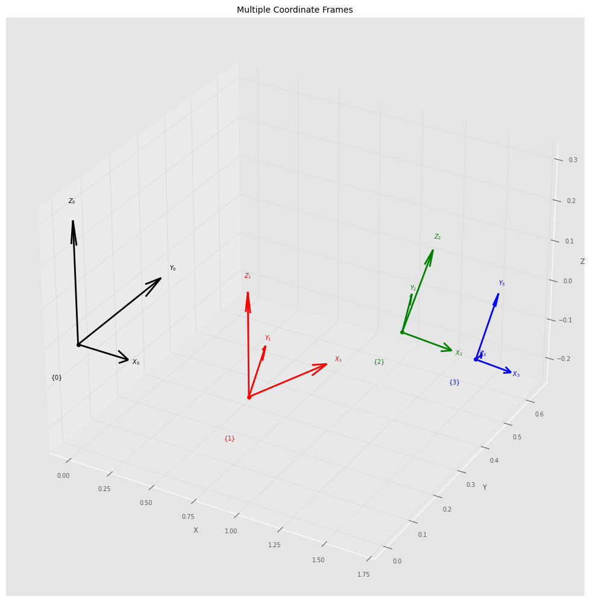
    


## 4. Robot Modeling and Kinematics

Now let's work with robot models using the Robotics Toolbox.

### 4.1 Creating a Simple 2-Link Planar Robot


```python
# Define link lengths
L1 = 1.0
L2 = 0.8

# Create robot using DH parameters
# RevoluteDH(d, a, alpha, offset)
robot_2link = DHRobot([
    RevoluteDH(d=0, a=L1, alpha=0, offset=0),
    RevoluteDH(d=0, a=L2, alpha=0, offset=0)
], name="2-Link Planar")

print(robot_2link)
print("\nDH Parameters:")
print(robot_2link.links)
```

    DHRobot: 2-Link Planar, 2 joints (RR), dynamics, standard DH parameters
    ┌─────┬────┬─────┬──────┐
    │ θⱼ  │ dⱼ │ aⱼ  │  ⍺ⱼ  │
    ├─────┼────┼─────┼──────┤
    │  q1 │  0 │   1 │ 0.0° │
    │  q2 │  0 │ 0.8 │ 0.0° │
    └─────┴────┴─────┴──────┘
    
    ┌──┬──┐
    └──┴──┘
    
    
    DH Parameters:
    [RevoluteDH(d=0, a=1, ⍺=0, name = "link1", m=0, r=[0, 0, 0], I=[0, 0, 0, 0, 0, 0], Jm=0, B=0, Tc=[0, 0], G=0), RevoluteDH(d=0, a=0.8, ⍺=0, name = "link2", parent="link1", m=0, r=[0, 0, 0], I=[0, 0, 0, 0, 0, 0], Jm=0, B=0, Tc=[0, 0], G=0)]


### 4.2 Forward Kinematics


```python
# Define joint angles
q1 = np.array([0, 0])  # Both joints at 0°
q2 = np.array([pi/4, pi/4])  # Both joints at 45°
q3 = np.array([pi/3, -pi/6])  # 60° and -30°

# Compute forward kinematics
T1 = robot_2link.fkine(q1)
T2 = robot_2link.fkine(q2)
T3 = robot_2link.fkine(q3)

print("End-effector pose for q=[0, 0]:")
print(T1)
print(f"Position: {T1.t}")

print("\nEnd-effector pose for q=[π/4, π/4]:")
print(f"Position: {T2.t}")

print("\nEnd-effector pose for q=[π/3, -π/6]:")
print(f"Position: {T3.t}")
```

    End-effector pose for q=[0, 0]:
       1         0         0         1.8       
       0         1         0         0         
       0         0         1         0         
       0         0         0         1         
    
    Position: [1.8 0.  0. ]
    
    End-effector pose for q=[π/4, π/4]:
    Position: [0.70710678 1.50710678 0.        ]
    
    End-effector pose for q=[π/3, -π/6]:
    Position: [1.19282032 1.2660254  0.        ]


### 4.3 Visualizing Robot Configurations


```python
# Plot robot in different configurations
# Note: We'll compute and plot the robot manually for better control in Colab

def plot_2link_robot(ax, q, L1=1.0, L2=0.8, title=''):
    """Manually plot 2-link robot configuration"""
    # Joint positions
    p0 = np.array([0, 0])
    p1 = np.array([L1 * np.cos(q[0]), L1 * np.sin(q[0])])
    p2 = p1 + np.array([L2 * np.cos(q[0] + q[1]), L2 * np.sin(q[0] + q[1])])

    # Plot links
    ax.plot([p0[0], p1[0]], [p0[1], p1[1]], 'b-', linewidth=4, label='Link 1')
    ax.plot([p1[0], p2[0]], [p1[1], p2[1]], 'r-', linewidth=4, label='Link 2')

    # Plot joints
    ax.plot(p0[0], p0[1], 'ko', markersize=10, label='Base')
    ax.plot(p1[0], p1[1], 'go', markersize=8, label='Joint 1')
    ax.plot(p2[0], p2[1], 'rs', markersize=10, label='End-effector')

    ax.set_xlabel('X (m)')
    ax.set_ylabel('Y (m)')
    ax.set_title(title)
    ax.grid(True, alpha=0.3)
    ax.axis('equal')
    ax.legend(fontsize=8)

fig, axes = plt.subplots(1, 3, figsize=(15, 5))

configs = [q1, q2, q3]
titles = ['q=[0, 0]', 'q=[π/4, π/4]', 'q=[π/3, -π/6]']

for ax, q, title in zip(axes, configs, titles):
    plot_2link_robot(ax, q, title=title)
    ax.set_xlim([-0.5, 2])
    ax.set_ylim([-0.5, 2])

plt.suptitle('Robot in Different Configurations', fontsize=14, fontweight='bold')
plt.tight_layout()
plt.show()
```

    WARNING:matplotlib.axes._base:Ignoring fixed x limits to fulfill fixed data aspect with adjustable data limits.
    WARNING:matplotlib.axes._base:Ignoring fixed x limits to fulfill fixed data aspect with adjustable data limits.
    WARNING:matplotlib.axes._base:Ignoring fixed x limits to fulfill fixed data aspect with adjustable data limits.
    WARNING:matplotlib.axes._base:Ignoring fixed y limits to fulfill fixed data aspect with adjustable data limits.
    WARNING:matplotlib.axes._base:Ignoring fixed y limits to fulfill fixed data aspect with adjustable data limits.
    WARNING:matplotlib.axes._base:Ignoring fixed y limits to fulfill fixed data aspect with adjustable data limits.


    
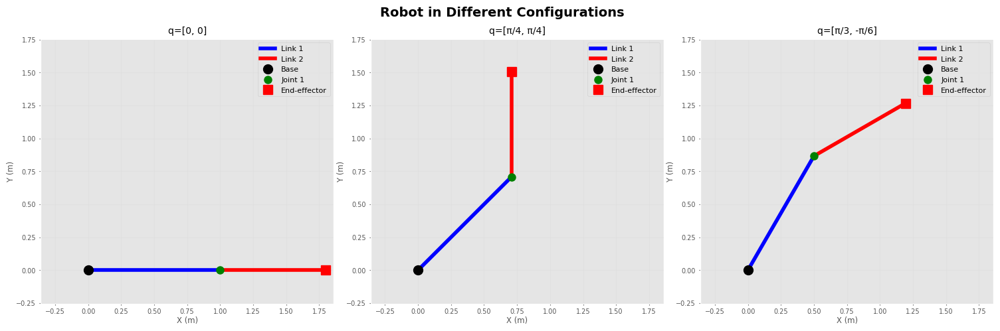
    


### 4.4 Working with Industrial Robots (Puma 560)


```python
# Load a predefined robot model
puma = rtb.models.DH.Puma560()

print("Puma 560 Robot:")
print(puma)

# Get robot properties
print(f"\nNumber of joints: {puma.n}")
print(f"\nDH Parameters:")
print(puma.links)

# Define a joint configuration
q_puma = puma.qn  # Nominal pose
print(f"\nNominal joint angles (rad): {q_puma}")
print(f"Nominal joint angles (deg): {np.degrees(q_puma)}")

# Compute forward kinematics
T_ee = puma.fkine(q_puma)
print(f"\nEnd-effector position: {T_ee.t}")
```

    Puma 560 Robot:
    DHRobot: Puma 560 (by Unimation), 6 joints (RRRRRR), dynamics, geometry, standard DH parameters
    ┌─────┬────────┬────────┬────────┬─────────┬────────┐
    │ θⱼ  │   dⱼ   │   aⱼ   │   ⍺ⱼ   │   q⁻    │   q⁺   │
    ├─────┼────────┼────────┼────────┼─────────┼────────┤
    │  q1 │ 0.6718 │      0 │  90.0° │ -160.0° │ 160.0° │
    │  q2 │      0 │ 0.4318 │   0.0° │ -110.0° │ 110.0° │
    │  q3 │   0.15 │ 0.0203 │ -90.0° │ -135.0° │ 135.0° │
    │  q4 │ 0.4318 │      0 │  90.0° │ -266.0° │ 266.0° │
    │  q5 │      0 │      0 │ -90.0° │ -100.0° │ 100.0° │
    │  q6 │      0 │      0 │   0.0° │ -266.0° │ 266.0° │
    └─────┴────────┴────────┴────────┴─────────┴────────┘
    
    ┌──┬──┐
    └──┴──┘
    
    ┌──────┬─────┬──────┬───────┬─────┬──────┬─────┐
    │ name │ q0  │ q1   │ q2    │ q3  │ q4   │ q5  │
    ├──────┼─────┼──────┼───────┼─────┼──────┼─────┤
    │   qr │  0° │  90° │ -90°  │  0° │  0°  │  0° │
    │   qz │  0° │  0°  │  0°   │  0° │  0°  │  0° │
    │   qn │  0° │  45° │  180° │  0° │  45° │  0° │
    │   qs │  0° │  0°  │ -90°  │  0° │  0°  │  0° │
    └──────┴─────┴──────┴───────┴─────┴──────┴─────┘
    
    
    Number of joints: 6
    
    DH Parameters:
    [RevoluteDH(d=0.672, a=0, ⍺=1.57, name = "link1", qlim=[-2.79, 2.79], m=0, r=[0, 0, 0], I=[0, 0.35, 0, 0, 0, 0], Jm=0.0002, B=0.00148, Tc=[0.395, -0.435], G=-62.6), RevoluteDH(d=0, a=0.432, ⍺=0, name = "link2", parent="link1", qlim=[-1.92, 1.92], m=17.4, r=[-0.364, 0.006, 0.228], I=[0.13, 0.524, 0.539, 0, 0, 0], Jm=0.0002, B=0.000817, Tc=[0.126, -0.071], G=108), RevoluteDH(d=0.15, a=0.0203, ⍺=-1.57, name = "link3", parent="link2", qlim=[-2.36, 2.36], m=4.8, r=[-0.0203, -0.0141, 0.07], I=[0.066, 0.086, 0.0125, 0, 0, 0], Jm=0.0002, B=0.00138, Tc=[0.132, -0.105], G=-53.7), RevoluteDH(d=0.432, a=0, ⍺=1.57, name = "link4", parent="link3", qlim=[-4.64, 4.64], m=0.82, r=[0, 0.019, 0], I=[0.0018, 0.0013, 0.0018, 0, 0, 0], Jm=3.3e-05, B=7.12e-05, Tc=[0.0112, -0.0169], G=76), RevoluteDH(d=0, a=0, ⍺=-1.57, name = "link5", parent="link4", qlim=[-1.75, 1.75], m=0.34, r=[0, 0, 0], I=[0.0003, 0.0004, 0.0003, 0, 0, 0], Jm=3.3e-05, B=8.26e-05, Tc=[0.00926, -0.0145], G=71.9), RevoluteDH(d=0, a=0, ⍺=0, name = "link6", parent="link5", qlim=[-4.64, 4.64], m=0.09, r=[0, 0, 0.032], I=[0.00015, 0.00015, 4e-05, 0, 0, 0], Jm=3.3e-05, B=3.67e-05, Tc=[0.00396, -0.0105], G=76.7)]
    
    Nominal joint angles (rad): [0.         0.78539816 3.14159265 0.         0.78539816 0.        ]
    Nominal joint angles (deg): [  0.  45. 180.   0.  45.   0.]
    
    End-effector position: [ 0.59630315 -0.15005     0.65747573]


### 4.5 Inverse Kinematics


```python
# Define a desired end-effector pose
T_desired = SE3(0.4, 0.3, 0.2) * SE3.Rz(45, unit='deg')

print("Desired end-effector pose:")
print(T_desired)

# Solve inverse kinematics
sol = puma.ikine_LM(T_desired)  # Levenberg-Marquardt method

if sol.success:
    q_ik = sol.q
    print(f"\nIK Solution found!")
    print(f"Joint angles (rad): {q_ik}")
    print(f"Joint angles (deg): {np.degrees(q_ik)}")

    # Verify the solution
    T_verify = puma.fkine(q_ik)
    print(f"\nVerification - achieved position: {T_verify.t}")
    print(f"Position error: {np.linalg.norm(T_desired.t - T_verify.t):.6f}")
else:
    print("IK solution not found!")
```

    Desired end-effector pose:
       0.7071   -0.7071    0         0.4       
       0.7071    0.7071    0         0.3       
       0         0         1         0.2       
       0         0         0         1         
    
    
    IK Solution found!
    Joint angles (rad): [ 9.48298591e-01 -1.46225002e+00 -1.60209823e-01 -1.71516135e-11
      1.62245984e+00 -1.62900427e-01]
    Joint angles (deg): [ 5.43335070e+01 -8.37807547e+01 -9.17934671e+00 -9.82715063e-10
      9.29601014e+01 -9.33350697e+00]
    
    Verification - achieved position: [0.4 0.3 0.2]
    Position error: 0.000000


### 4.6 Jacobian and Manipulability


```python
# Compute Jacobian at a configuration
q = puma.qn
J = puma.jacob0(q)  # Jacobian in world frame

print("Jacobian matrix (6x6):")
print(J)

# Compute manipulability
m = puma.manipulability(q)
print(f"\nManipulability measure: {m:.4f}")

# Check if at singularity
print(f"\nJacobian condition number: {np.linalg.cond(J):.2f}")
if np.linalg.cond(J) > 100:
    print("Warning: Close to singularity!")
else:
    print("Configuration is well-conditioned.")
```

    Jacobian matrix (6x6):
    [[ 1.50050000e-01  1.43542677e-02  3.19682976e-01  0.00000000e+00
       0.00000000e+00  0.00000000e+00]
     [ 5.96303149e-01  3.65130371e-17  1.78170459e-17  0.00000000e+00
       0.00000000e+00  0.00000000e+00]
     [-5.28447268e-18  5.96303149e-01  2.90974440e-01  0.00000000e+00
       0.00000000e+00  0.00000000e+00]
     [-3.52180785e-17  0.00000000e+00  0.00000000e+00  7.07106781e-01
       0.00000000e+00  1.00000000e+00]
     [ 6.86402876e-33 -1.00000000e+00 -1.00000000e+00 -1.04530143e-16
      -1.00000000e+00 -6.12323400e-17]
     [ 1.00000000e+00  6.12323400e-17  6.12323400e-17 -7.07106781e-01
       6.12323400e-17 -3.13396163e-16]]
    
    Manipulability measure: 0.0786
    
    Jacobian condition number: 7.88
    Configuration is well-conditioned.


## 5. Trajectory Planning with Visualization

Let's create smooth trajectories for robot motion.

### 5.1 Joint Space Trajectory


```python
from roboticstoolbox import jtraj, ctraj

# Define start and goal joint configurations
q_start = np.array([0, 0])
q_goal = np.array([pi/2, pi/4])

# Generate joint trajectory (50 steps)
traj = jtraj(q_start, q_goal, 50)

print(f"Trajectory shape: {traj.q.shape}")
print(f"Number of time steps: {len(traj.q)}")

# Plot joint trajectories
fig, axes = plt.subplots(2, 1, figsize=(10, 8))

time = np.arange(len(traj.q))

axes[0].plot(time, traj.q[:, 0], 'b-', linewidth=2, label='Joint 1')
axes[0].set_ylabel('Joint 1 (rad)')
axes[0].set_title('Joint Space Trajectory')
axes[0].grid(True)
axes[0].legend()

axes[1].plot(time, traj.q[:, 1], 'r-', linewidth=2, label='Joint 2')
axes[1].set_xlabel('Time step')
axes[1].set_ylabel('Joint 2 (rad)')
axes[1].grid(True)
axes[1].legend()

plt.tight_layout()
plt.show()
```

    Trajectory shape: (50, 2)
    Number of time steps: 50


    
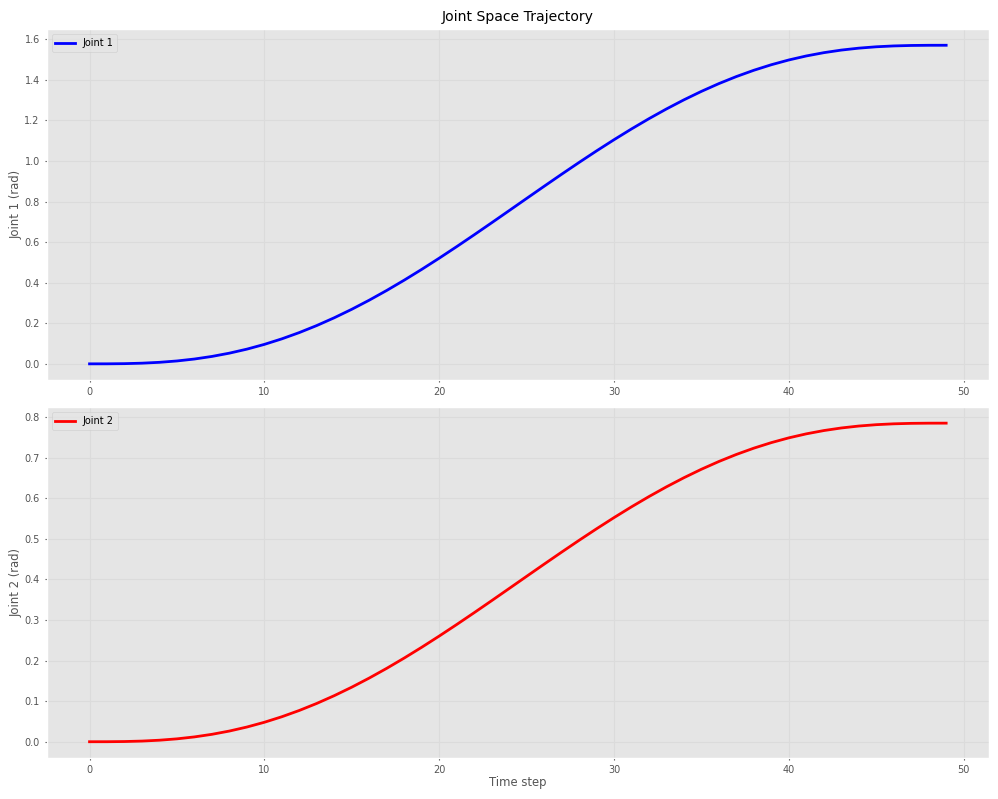
    


### 5.2 Cartesian Space Trajectory


```python
# Define start and goal poses
T_start = SE3(0.4, 0.2, 0.3)
T_goal = SE3(0.3, 0.5, 0.4) * SE3.Rz(90, unit='deg')

# Generate Cartesian trajectory
T_traj = ctraj(T_start, T_goal, 50)

print(f"Number of poses in trajectory: {len(T_traj)}")

# Extract positions for plotting
positions = np.array([T.t for T in T_traj])

# Plot 3D trajectory
fig = plt.figure(figsize=(10, 8))
ax = fig.add_subplot(111, projection='3d')

ax.plot(positions[:, 0], positions[:, 1], positions[:, 2],
            'b-', linewidth=2, label='Trajectory')
ax.scatter([T_start.t[0]], [T_start.t[1]], [T_start.t[2]],
           c='green', s=100, marker='o', label='Start')
ax.scatter([T_goal.t[0]], [T_goal.t[1]], [T_goal.t[2]],
           c='red', s=100, marker='s', label='Goal')

ax.set_xlabel('X (m)')
ax.set_ylabel('Y (m)')
ax.set_zlabel('Z (m)')
ax.set_title('Cartesian Space Trajectory')
ax.legend()
plt.tight_layout()
plt.show()
```

    Number of poses in trajectory: 50


    
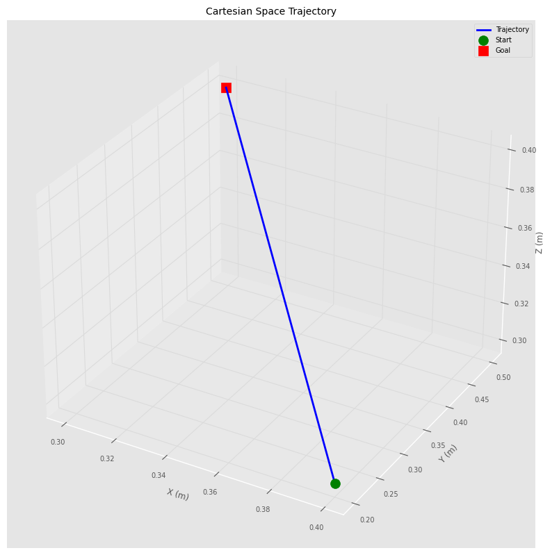
    


### 5.3 Visualizing Robot Motion Along Trajectory


```python
# Generate trajectory for 2-link robot\n",
q_start_2link = np.array([0, 0])
q_goal_2link = np.array([pi/2, -pi/4])
traj_2link = jtraj(q_start_2link, q_goal_2link, 50)  # 50 steps

# Plot robot at different points along trajectory
fig, axes = plt.subplots(2, 3, figsize=(15, 10))
axes = axes.flatten()

indices = [0, 10, 20, 30, 40, 49]

for i, (ax, idx) in enumerate(zip(axes, indices)):
    q = traj_2link.q[idx]
    plot_2link_robot(ax, q, title=f'Step {idx}: q=[{q[0]:.2f}, {q[1]:.2f}]')
    ax.set_xlim([-0.5, 2])
    ax.set_ylim([-0.5, 2])

plt.suptitle('Robot Motion Along Trajectory', fontsize=16, fontweight='bold')
plt.tight_layout()
plt.show()
```

    WARNING:matplotlib.axes._base:Ignoring fixed x limits to fulfill fixed data aspect with adjustable data limits.
    WARNING:matplotlib.axes._base:Ignoring fixed x limits to fulfill fixed data aspect with adjustable data limits.
    WARNING:matplotlib.axes._base:Ignoring fixed x limits to fulfill fixed data aspect with adjustable data limits.
    WARNING:matplotlib.axes._base:Ignoring fixed x limits to fulfill fixed data aspect with adjustable data limits.
    WARNING:matplotlib.axes._base:Ignoring fixed x limits to fulfill fixed data aspect with adjustable data limits.
    WARNING:matplotlib.axes._base:Ignoring fixed x limits to fulfill fixed data aspect with adjustable data limits.
    WARNING:matplotlib.axes._base:Ignoring fixed y limits to fulfill fixed data aspect with adjustable data limits.
    WARNING:matplotlib.axes._base:Ignoring fixed y limits to fulfill fixed data aspect with adjustable data limits.
    WARNING:matplotlib.axes._base:Ignoring fixed y limits to fulfill fixed data aspect with adjustable data limits.
    WARNING:matplotlib.axes._base:Ignoring fixed y limits to fulfill fixed data aspect with adjustable data limits.
    WARNING:matplotlib.axes._base:Ignoring fixed y limits to fulfill fixed data aspect with adjustable data limits.
    WARNING:matplotlib.axes._base:Ignoring fixed y limits to fulfill fixed data aspect with adjustable data limits.


    
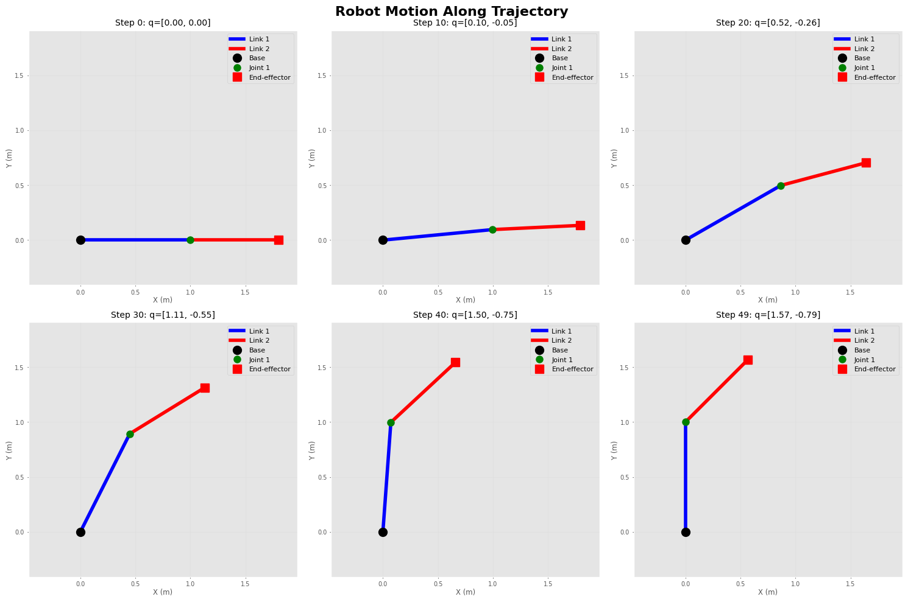
    


### 5.4 Computing End-Effector Path


```python
# Compute end-effector positions along trajectory
ee_positions = []
for q in traj_2link.q:
    T = robot_2link.fkine(q)
    ee_positions.append(T.t[:2])  # Only X and Y for planar robot

ee_positions = np.array(ee_positions)

# Plot end-effector path
plt.figure(figsize=(10, 8))
plt.plot(ee_positions[:, 0], ee_positions[:, 1], 'b-o', linewidth=2, markersize=6)
plt.scatter([ee_positions[0, 0]], [ee_positions[0, 1]],
           c='green', s=150, marker='o', label='Start', zorder=5)
plt.scatter([ee_positions[-1, 0]], [ee_positions[-1, 1]],
           c='red', s=150, marker='s', label='Goal', zorder=5)

plt.xlabel('X (m)')
plt.ylabel('Y (m)')
plt.title('End-Effector Path')
plt.grid(True)
plt.legend()
plt.axis('equal')
plt.tight_layout()
plt.show()

print(f"Path length: {len(ee_positions)} points")
print(f"Start position: {ee_positions[0]}")
print(f"Goal position: {ee_positions[-1]}")
```


    
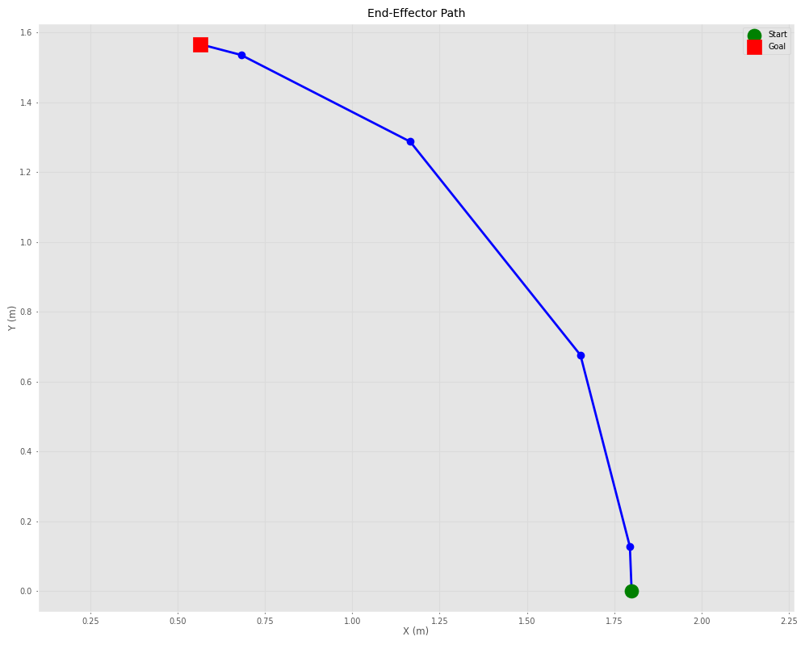
    


    Path length: 6 points
    Start position: [1.8 0. ]
    Goal position: [0.56568542 1.56568542]


## 6. Advanced Topics and Visualizations

Let's explore some advanced concepts in robotics.

### 6.1 Workspace Analysis


```python
# Generate random configurations and compute reachable positions
n_samples = 1000
workspace_points = []

for _ in range(n_samples):
    # Random joint angles within limits
    q = np.random.uniform(-pi, pi, 2)
    T = robot_2link.fkine(q)
    workspace_points.append(T.t[:2])

workspace_points = np.array(workspace_points)

# Plot workspace
plt.figure(figsize=(10, 10))
plt.scatter(workspace_points[:, 0], workspace_points[:, 1],
           c='blue', alpha=0.3, s=1)
plt.xlabel('X (m)')
plt.ylabel('Y (m)')
plt.title('Robot Workspace (2-Link Planar Robot)')
plt.grid(True)
plt.axis('equal')
plt.tight_layout()
plt.show()

print(f"Workspace samples: {n_samples}")
print(f"Max reach: {np.max(np.linalg.norm(workspace_points, axis=1)):.3f} m")
print(f"Min reach: {np.min(np.linalg.norm(workspace_points, axis=1)):.3f} m")
```


    
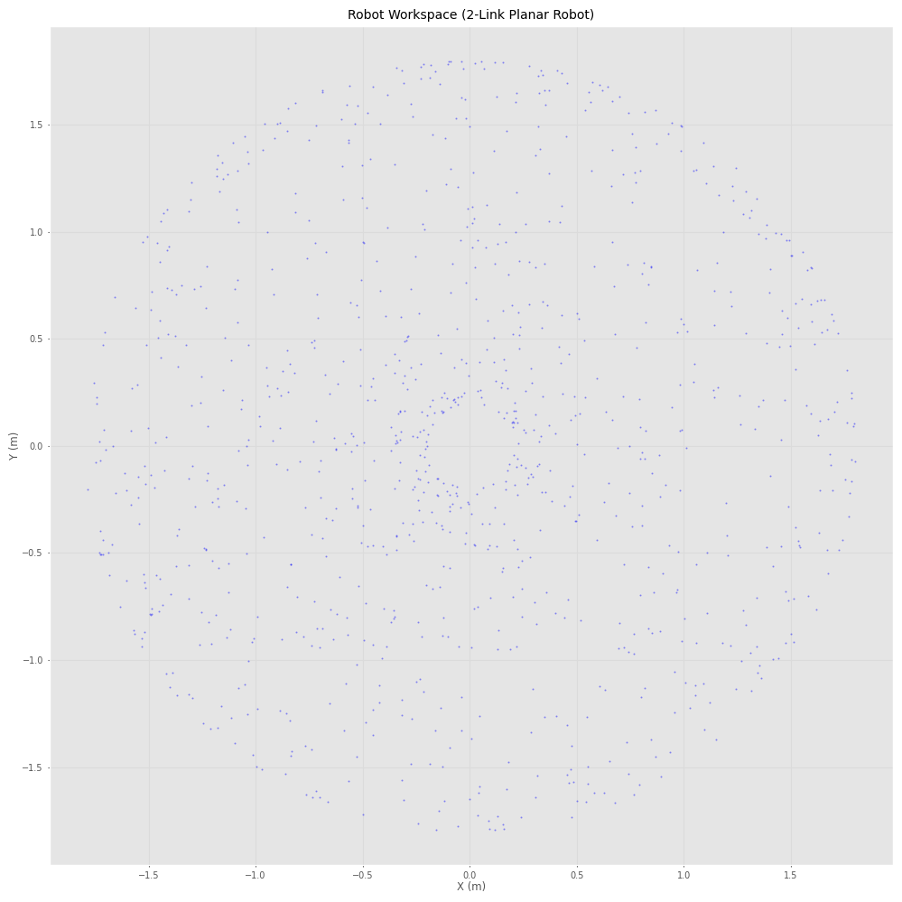
    


    Workspace samples: 1000
    Max reach: 1.800 m
    Min reach: 0.200 m


### 6.2 Velocity Kinematics


```python
# Define a configuration and joint velocities
q = np.array([pi/4, pi/6])
qd = np.array([0.5, -0.3])  # Joint velocities (rad/s)

# Compute Jacobian
J = robot_2link.jacob0(q)
print("Jacobian (6x2 for planar robot):")
print(J)

# Compute end-effector velocity
v = J @ qd
print(f"\nJoint velocities: {qd}")
print(f"End-effector velocity (spatial): {v}")
print(f"Linear velocity [vx, vy, vz]: {v[:3]}")
print(f"Angular velocity [wx, wy, wz]: {v[3:]}")
```

    Jacobian (6x2 for planar robot):
    [[-1.47984744 -0.77274066]
     [ 0.91416202  0.20705524]
     [ 0.          0.        ]
     [ 0.          0.        ]
     [ 0.          0.        ]
     [ 1.          1.        ]]
    
    Joint velocities: [ 0.5 -0.3]
    End-effector velocity (spatial): [-0.50810152  0.39496444  0.          0.          0.          0.2       ]
    Linear velocity [vx, vy, vz]: [-0.50810152  0.39496444  0.        ]
    Angular velocity [wx, wy, wz]: [0.  0.  0.2]


### 6.3 Creating a Custom Robot


```python
# Create a 3-DOF robot (RRR)
L1, L2, L3 = 0.5, 0.4, 0.3

custom_robot = DHRobot([
    RevoluteDH(d=0, a=L1, alpha=0),
    RevoluteDH(d=0, a=L2, alpha=0),
    RevoluteDH(d=0, a=L3, alpha=0)
], name="Custom 3-DOF")

print("Custom 3-DOF Robot:")
print(custom_robot)

# Test configuration
q_test = np.array([pi/6, pi/4, -pi/3])
T_test = custom_robot.fkine(q_test)

print(f"\nTest configuration: {np.degrees(q_test)}°")
print(f"End-effector position: {T_test.t}")

# Manual plotting function for 3-link planar robot
def plot_3link_robot(q, L=[0.5, 0.4, 0.3]):
    """Plot 3-link planar robot"""
    fig, ax = plt.subplots(figsize=(10, 8))

    # Compute joint positions
    p0 = np.array([0, 0])
    p1 = np.array([L[0] * np.cos(q[0]), L[0] * np.sin(q[0])])
    p2 = p1 + np.array([L[1] * np.cos(q[0] + q[1]), L[1] * np.sin(q[0] + q[1])])
    p3 = p2 + np.array([L[2] * np.cos(q[0] + q[1] + q[2]),
                        L[2] * np.sin(q[0] + q[1] + q[2])])

    # Plot links
    ax.plot([p0[0], p1[0]], [p0[1], p1[1]], 'b-', linewidth=5, label='Link 1')
    ax.plot([p1[0], p2[0]], [p1[1], p2[1]], 'g-', linewidth=4, label='Link 2')
    ax.plot([p2[0], p3[0]], [p2[1], p3[1]], 'r-', linewidth=3, label='Link 3')

    # Plot joints
    ax.plot(p0[0], p0[1], 'ko', markersize=12, label='Base', zorder=5)
    ax.plot(p1[0], p1[1], 'bo', markersize=10, zorder=5)
    ax.plot(p2[0], p2[1], 'go', markersize=10, zorder=5)
    ax.plot(p3[0], p3[1], 'rs', markersize=12, label='End-effector', zorder=5)

    ax.set_xlim([-0.5, 1.5])
    ax.set_ylim([-1, 1])
    ax.set_xlabel('X (m)')
    ax.set_ylabel('Y (m)')
    ax.set_title('Custom 3-DOF Robot')
    ax.grid(True, alpha=0.3)
    ax.axis('equal')
    ax.legend()
    plt.tight_layout()
    return fig, ax

# Plot the robot
fig, ax = plot_3link_robot(q_test, L=[L1, L2, L3])
plt.show()
```

    Custom 3-DOF Robot:
    DHRobot: Custom 3-DOF, 3 joints (RRR), dynamics, standard DH parameters
    ┌─────┬────┬─────┬──────┐
    │ θⱼ  │ dⱼ │ aⱼ  │  ⍺ⱼ  │
    ├─────┼────┼─────┼──────┤
    │  q1 │  0 │ 0.5 │ 0.0° │
    │  q2 │  0 │ 0.4 │ 0.0° │
    │  q3 │  0 │ 0.3 │ 0.0° │
    └─────┴────┴─────┴──────┘
    
    ┌──┬──┐
    └──┴──┘
    
    
    Test configuration: [ 30.  45. -60.]°
    End-effector position: [0.82631807 0.71401604 0.        ]


    
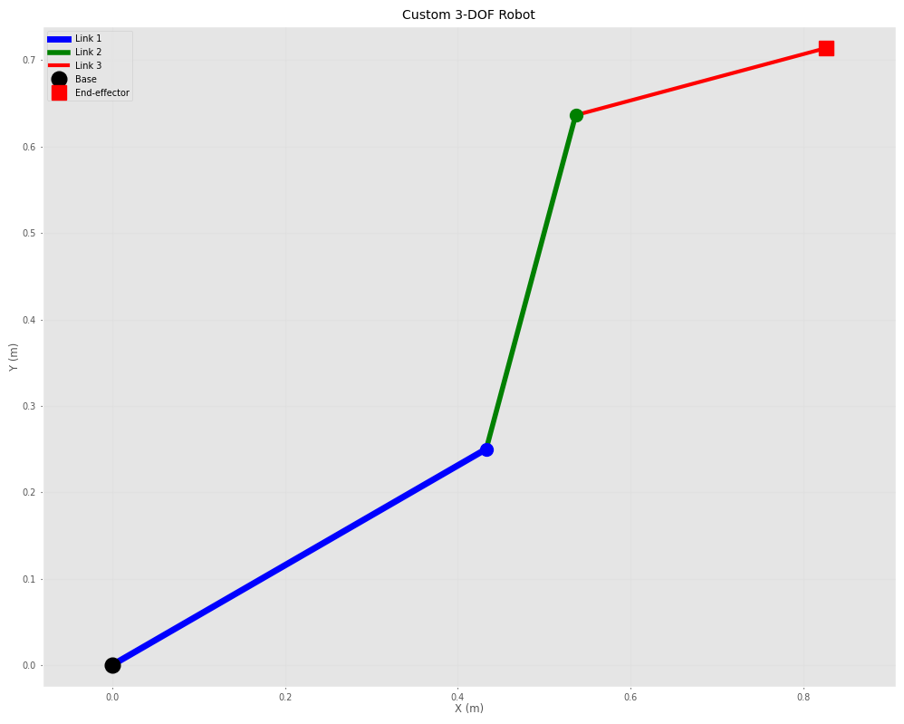
    


### 6.4 Dynamics (if needed)


```python
# For robots with dynamics parameters, you can compute:
# - Inertia matrix
# - Coriolis/centripetal matrix
# - Gravity loading

# Note: Our simple robots don't have mass properties defined
# For real dynamics, you'd need to specify link masses and inertias

print("Dynamics Example (conceptual):")
print("\nFor a robot with dynamics, you would compute:")
print("1. M(q) - Inertia matrix: robot.inertia(q)")
print("2. C(q,qd) - Coriolis matrix: robot.coriolis(q, qd)")
print("3. g(q) - Gravity loading: robot.gravload(q)")
print("\nEquation of motion: M(q)·q̈ + C(q,q̇)·q̇ + g(q) = τ")
```

    Dynamics Example (conceptual):
    
    For a robot with dynamics, you would compute:
    1. M(q) - Inertia matrix: robot.inertia(q)
    2. C(q,qd) - Coriolis matrix: robot.coriolis(q, qd)
    3. g(q) - Gravity loading: robot.gravload(q)
    
    Equation of motion: M(q)·q̈ + C(q,q̇)·q̇ + g(q) = τ


### 6.5 Interpolation Between Poses


```python
# Create start and end poses
T_A = SE3(0, 0, 0) * SE3.Rz(0)
T_B = SE3(1, 1, 0) * SE3.Rz(90, unit='deg')

print("Pose A:")
print(T_A)
print("\nPose B:")
print(T_B)

# Interpolate between poses
n_steps = 10
interpolated_poses = []

for s in np.linspace(0, 1, n_steps):
    T_interp = T_A.interp(T_B, s)
    interpolated_poses.append(T_interp)

# Visualize interpolated frames
fig = plt.figure(figsize=(12, 10))
ax = fig.add_subplot(111, projection='3d')

for i, T in enumerate(interpolated_poses):
    alpha = 0.3 + 0.7 * (i / (n_steps - 1))
    T.plot(ax=ax, frame=f'{i}', length=0.15, width=1.5)

ax.set_xlabel('X')
ax.set_ylabel('Y')
ax.set_zlabel('Z')
ax.set_title('Pose Interpolation')
plt.tight_layout()
plt.show()

print(f"\nGenerated {n_steps} interpolated poses")
```

    Pose A:
       1         0         0         0         
       0         1         0         0         
       0         0         1         0         
       0         0         0         1         
    
    
    Pose B:
       0        -1         0         1         
       1         0         0         1         
       0         0         1         0         
       0         0         0         1         
    


    
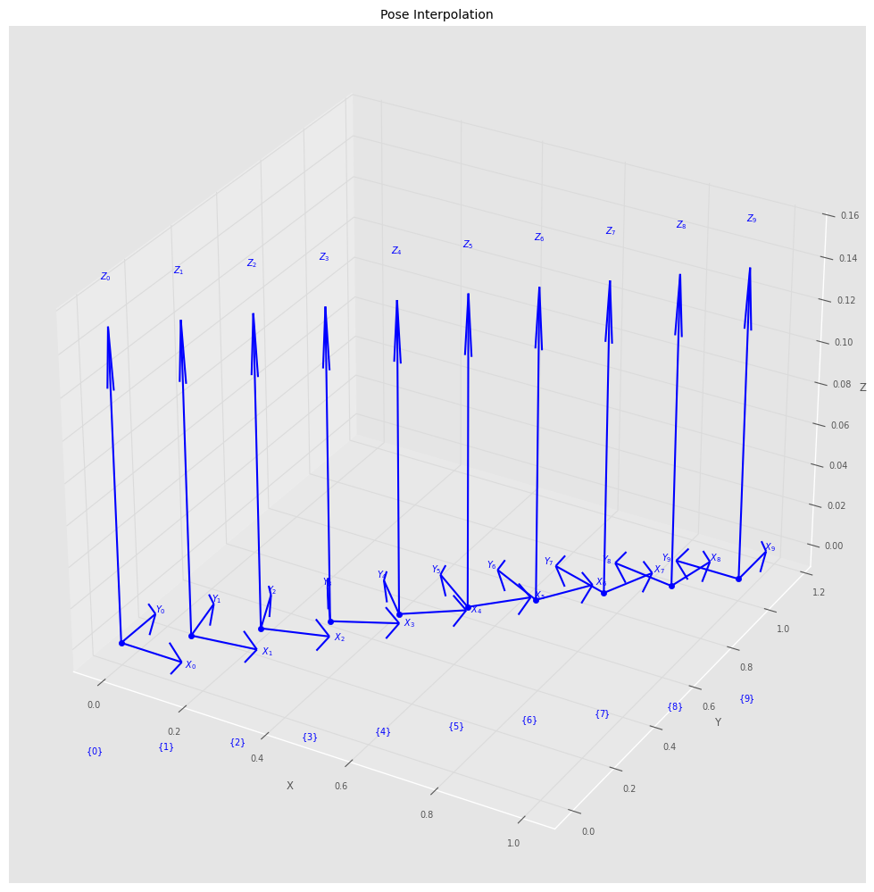
    


    
    Generated 10 interpolated poses


## 7. Practical Examples

Let's work through some practical robotics problems.

### 7.1 Pick and Place Task


```python
# Define pick and place locations
pick_pose = SE3(0.5, 0.3, 0.2) * SE3.Rz(0)
place_pose = SE3(0.3, -0.4, 0.25) * SE3.Rz(45, unit='deg')
approach_height = 0.1  # Approach from above

# Define waypoints
approach_pick = SE3(pick_pose.t[0], pick_pose.t[1], pick_pose.t[2] + approach_height) * SE3.Rz(0)
approach_place = SE3(place_pose.t[0], place_pose.t[1], place_pose.t[2] + approach_height) * SE3.Rz(45, unit='deg')

waypoints = [approach_pick, pick_pose, approach_pick, approach_place, place_pose, approach_place]
labels = ['Approach Pick', 'Pick', 'Lift', 'Approach Place', 'Place', 'Retract']

print("Pick and Place Waypoints:")
for label, wp in zip(labels, waypoints):
    print(f"{label}: {wp.t}")

# Visualize waypoints
fig = plt.figure(figsize=(12, 10))
ax = fig.add_subplot(111, projection='3d')

positions = np.array([wp.t for wp in waypoints])
ax.plot(positions[:, 0], positions[:, 1], positions[:, 2],
        'b-o', linewidth=2, markersize=8, label='Path')

for i, (label, wp) in enumerate(zip(labels, waypoints)):
    wp.plot(ax=ax, frame=label, length=0.05, width=1)

ax.set_xlabel('X (m)')
ax.set_ylabel('Y (m)')
ax.set_zlabel('Z (m)')
ax.set_title('Pick and Place Task Waypoints')
ax.legend()
plt.tight_layout()
plt.show()
```

    Pick and Place Waypoints:
    Approach Pick: [0.5 0.3 0.3]
    Pick: [0.5 0.3 0.2]
    Lift: [0.5 0.3 0.3]
    Approach Place: [ 0.3  -0.4   0.35]
    Place: [ 0.3  -0.4   0.25]
    Retract: [ 0.3  -0.4   0.35]


    
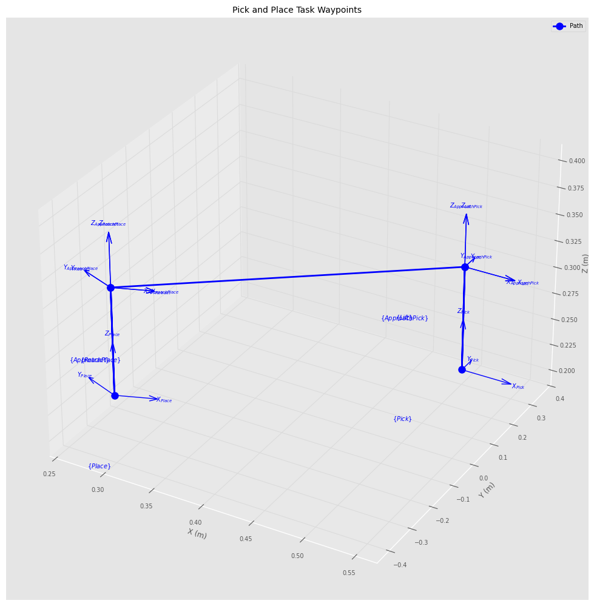
    


### 7.2 Circular Path Planning


```python
# Generate circular path in 3D space
center = np.array([0.5, 0, 0.3])
radius = 0.2
n_points = 50

circular_path = []
theta_values = np.linspace(0, 2*pi, n_points)

for theta in theta_values:
    x = center[0] + radius * np.cos(theta)
    y = center[1] + radius * np.sin(theta)
    z = center[2]

    # Create pose tangent to circle
    T = SE3(x, y, z) * SE3.Rz(theta + pi/2, unit='rad')
    circular_path.append(T)

# Visualize circular path
fig = plt.figure(figsize=(12, 10))
ax = fig.add_subplot(111, projection='3d')

path_positions = np.array([T.t for T in circular_path])
ax.plot(path_positions[:, 0], path_positions[:, 1], path_positions[:, 2],
        'b-', linewidth=2, label='Circular Path')

# Plot some frames along the path
for i in range(0, n_points, 5):
    circular_path[i].plot(ax=ax, frame='', length=0.05, width=1)

ax.set_xlabel('X (m)')
ax.set_ylabel('Y (m)')
ax.set_zlabel('Z (m)')
ax.set_title('Circular Path with Orientation')
ax.legend()
plt.tight_layout()
plt.show()

print(f"Generated circular path with {n_points} points")
print(f"Center: {center}")
print(f"Radius: {radius} m")
```


    
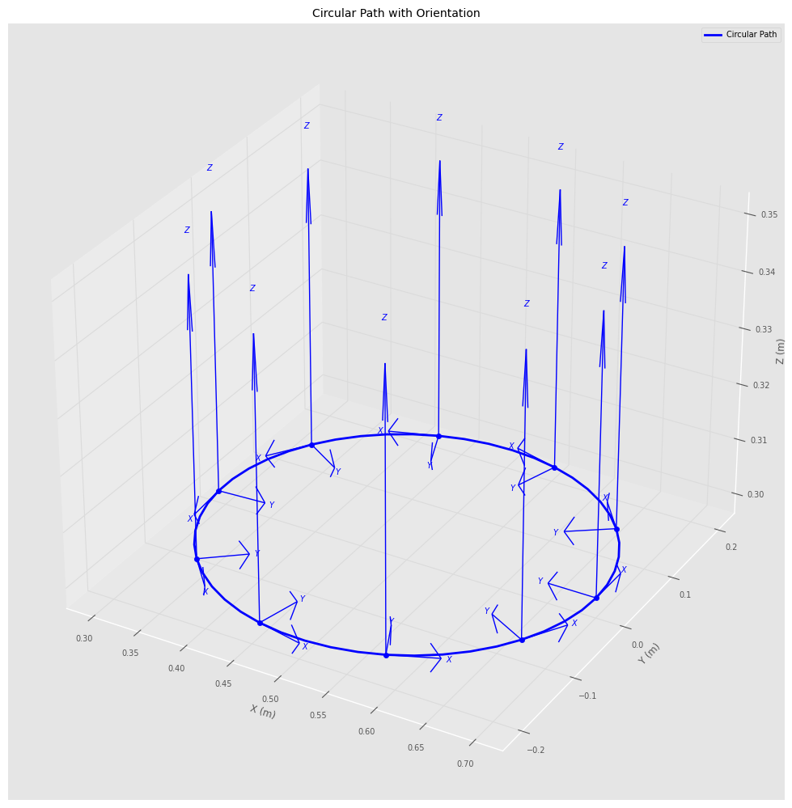
    


    Generated circular path with 50 points
    Center: [0.5 0.  0.3]
    Radius: 0.2 m


### 7.3 Manipulability Analysis Along Trajectory


```python
# Generate trajectory and compute manipulability at each point
q_start = np.array([0, pi/4])
q_end = np.array([pi/2, -pi/4])
traj = jtraj(q_start, q_end, 50)

manipulability_values = []
for q in traj.q:
    m = robot_2link.manipulability(q)
    manipulability_values.append(m)

# Plot manipulability along trajectory
fig, (ax1, ax2) = plt.subplots(2, 1, figsize=(12, 10))

time_steps = np.arange(len(traj.q))

# Plot joint angles
ax1.plot(time_steps, np.degrees(traj.q[:, 0]), 'b-', label='Joint 1', linewidth=2)
ax1.plot(time_steps, np.degrees(traj.q[:, 1]), 'r-', label='Joint 2', linewidth=2)
ax1.set_ylabel('Joint Angle (deg)')
ax1.set_title('Joint Trajectory')
ax1.legend()
ax1.grid(True)

# Plot manipulability
ax2.plot(time_steps, manipulability_values, 'g-', linewidth=2)
ax2.set_xlabel('Time Step')
ax2.set_ylabel('Manipulability')
ax2.set_title('Manipulability Along Trajectory')
ax2.grid(True)
ax2.axhline(y=np.mean(manipulability_values), color='r',
            linestyle='--', label=f'Mean: {np.mean(manipulability_values):.4f}')
ax2.legend()

plt.tight_layout()
plt.show()

print(f"Min manipulability: {np.min(manipulability_values):.4f}")
print(f"Max manipulability: {np.max(manipulability_values):.4f}")
print(f"Mean manipulability: {np.mean(manipulability_values):.4f}")
```


    
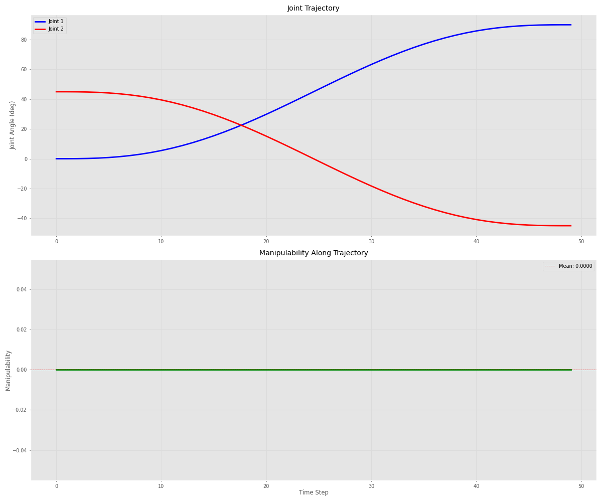
    


    Min manipulability: 0.0000
    Max manipulability: 0.0000
    Mean manipulability: 0.0000


## 8. Additional Resources and Further Learning

Here are some topics and resources for deeper exploration.

### 8.1 Key Concepts Summary


```python
summary = """
📚 KEY CONCEPTS COVERED:

1. SPATIAL MATHEMATICS
   - Rotation matrices (SO3)
   - Homogeneous transforms (SE3)
   - Unit quaternions
   - Euler angles and conversions

2. ROBOT KINEMATICS
   - Denavit-Hartenberg parameters
   - Forward kinematics
   - Inverse kinematics (numerical)
   - Jacobian matrices
   - Manipulability analysis

3. TRAJECTORY PLANNING
   - Joint space trajectories
   - Cartesian space trajectories
   - Path interpolation
   - Waypoint navigation

4. VISUALIZATION
   - Coordinate frames
   - Robot configurations
   - Workspace analysis
   - Motion animation concepts
"""

print(summary)
```

    
    📚 KEY CONCEPTS COVERED:
    
    1. SPATIAL MATHEMATICS
       - Rotation matrices (SO3)
       - Homogeneous transforms (SE3)
       - Unit quaternions
       - Euler angles and conversions
    
    2. ROBOT KINEMATICS
       - Denavit-Hartenberg parameters
       - Forward kinematics
       - Inverse kinematics (numerical)
       - Jacobian matrices
       - Manipulability analysis
    
    3. TRAJECTORY PLANNING
       - Joint space trajectories
       - Cartesian space trajectories
       - Path interpolation
       - Waypoint navigation
    
    4. VISUALIZATION
       - Coordinate frames
       - Robot configurations
       - Workspace analysis
       - Motion animation concepts
    


### 8.2 Further Topics to Explore


```python
further_topics = """
🚀 ADVANCED TOPICS FOR FURTHER STUDY:

1. ADVANCED KINEMATICS
   - Screw theory
   - Differential kinematics
   - Singularity analysis
   - Redundancy resolution

2. DYNAMICS
   - Equations of motion
   - Newton-Euler formulation
   - Lagrangian mechanics
   - Computed torque control

3. MOTION PLANNING
   - Collision detection
   - Path planning algorithms (RRT, PRM)
   - Optimal trajectory generation
   - Motion primitives

4. CONTROL
   - PID control
   - Impedance control
   - Force control
   - Visual servoing

5. ROBOT VISION
   - Camera models
   - Hand-eye calibration
   - Pose estimation
   - Object recognition
"""

print(further_topics)
```

    
    🚀 ADVANCED TOPICS FOR FURTHER STUDY:
    
    1. ADVANCED KINEMATICS
       - Screw theory
       - Differential kinematics
       - Singularity analysis
       - Redundancy resolution
    
    2. DYNAMICS
       - Equations of motion
       - Newton-Euler formulation
       - Lagrangian mechanics
       - Computed torque control
    
    3. MOTION PLANNING
       - Collision detection
       - Path planning algorithms (RRT, PRM)
       - Optimal trajectory generation
       - Motion primitives
    
    4. CONTROL
       - PID control
       - Impedance control
       - Force control
       - Visual servoing
    
    5. ROBOT VISION
       - Camera models
       - Hand-eye calibration
       - Pose estimation
       - Object recognition
    


### 8.3 Useful Resources


```python
resources = """
📖 DOCUMENTATION & RESOURCES:

Official Documentation:
- Spatialmath: https://github.com/petercorke/spatialmath-python
- Robotics Toolbox: https://github.com/petercorke/robotics-toolbox-python
- Online Documentation: https://petercorke.github.io/robotics-toolbox-python/

Books:
- "Robotics, Vision and Control" by Peter Corke
- "Modern Robotics" by Lynch & Park
- "Introduction to Robotics" by Craig

Online Courses:
- QUT Robot Academy: https://robotacademy.net.au/
- Coursera: Robotics Specialization
- MIT OpenCourseWare: Robotics courses

Community:
- GitHub Issues for both libraries
- ROS (Robot Operating System) community
- r/robotics on Reddit
"""

print(resources)
```

    
    📖 DOCUMENTATION & RESOURCES:
    
    Official Documentation:
    - Spatialmath: https://github.com/petercorke/spatialmath-python
    - Robotics Toolbox: https://github.com/petercorke/robotics-toolbox-python
    - Online Documentation: https://petercorke.github.io/robotics-toolbox-python/
    
    Books:
    - "Robotics, Vision and Control" by Peter Corke
    - "Modern Robotics" by Lynch & Park
    - "Introduction to Robotics" by Craig
    
    Online Courses:
    - QUT Robot Academy: https://robotacademy.net.au/
    - Coursera: Robotics Specialization
    - MIT OpenCourseWare: Robotics courses
    
    Community:
    - GitHub Issues for both libraries
    - ROS (Robot Operating System) community
    - r/robotics on Reddit
    


### 8.4 Quick Reference


```python
quick_ref = """
⚡ QUICK REFERENCE:

COMMON SPATIALMATH OPERATIONS:
┌─────────────────────────────────────────────────────────┐
│ SE3(x, y, z)              # Create translation          │
│ SE3.Rx/Ry/Rz(angle)       # Create rotation             │
│ T1 * T2                   # Compose transforms          │
│ T.inv()                   # Inverse transform           │
│ T * point                 # Transform point             │
│ T.t                       # Get translation             │
│ T.R                       # Get rotation matrix         │
│ T.rpy()                   # Get RPY angles              │
└─────────────────────────────────────────────────────────┘

COMMON ROBOTICS TOOLBOX OPERATIONS:
┌─────────────────────────────────────────────────────────┐
│ robot.fkine(q)            # Forward kinematics          │
│ robot.ikine_LM(T)         # Inverse kinematics          │
│ robot.jacob0(q)           # Jacobian (world frame)      │
│ robot.manipulability(q)   # Manipulability measure      │
│ robot.plot(q)             # Visualize robot             │
│ jtraj(q0, qf, n)          # Joint trajectory            │
│ ctraj(T0, Tf, n)          # Cartesian trajectory        │
└─────────────────────────────────────────────────────────┘
"""

print(quick_ref)
```

    
    ⚡ QUICK REFERENCE:
    
    COMMON SPATIALMATH OPERATIONS:
    ┌─────────────────────────────────────────────────────────┐
    │ SE3(x, y, z)              # Create translation          │
    │ SE3.Rx/Ry/Rz(angle)       # Create rotation             │
    │ T1 * T2                   # Compose transforms          │
    │ T.inv()                   # Inverse transform           │
    │ T * point                 # Transform point             │
    │ T.t                       # Get translation             │
    │ T.R                       # Get rotation matrix         │
    │ T.rpy()                   # Get RPY angles              │
    └─────────────────────────────────────────────────────────┘
    
    COMMON ROBOTICS TOOLBOX OPERATIONS:
    ┌─────────────────────────────────────────────────────────┐
    │ robot.fkine(q)            # Forward kinematics          │
    │ robot.ikine_LM(T)         # Inverse kinematics          │
    │ robot.jacob0(q)           # Jacobian (world frame)      │
    │ robot.manipulability(q)   # Manipulability measure      │
    │ robot.plot(q)             # Visualize robot             │
    │ jtraj(q0, qf, n)          # Joint trajectory            │
    │ ctraj(T0, Tf, n)          # Cartesian trajectory        │
    └─────────────────────────────────────────────────────────┘
    


## 9. Practice Exercises

Try these exercises to test your understanding!

### Exercise 1: Create and visualize a 4-DOF robot


```python
# YOUR CODE HERE
# Create a 4-DOF robot with your choice of link lengths
# Compute forward kinematics for at least 3 different configurations
# Visualize the robot in these configurations

pass  # Remove this and add your code
```

### Exercise 2: Plan a square trajectory


```python
# YOUR CODE HERE
# Create a square trajectory in Cartesian space
# The square should have 0.2m sides
# Generate smooth trajectories between corners
# Visualize the complete path

pass  # Remove this and add your code
```

### Exercise 3: Workspace boundary analysis


```python
# YOUR CODE HERE
# For a 2-link robot, find the exact boundary of the reachable workspace
# Hint: Consider maximum and minimum reach configurations
# Plot the workspace boundary as a circle/annulus

pass  # Remove this and add your code
```

## Congratulations!

You've completed this comprehensive guide to spatialmath-python and roboticstoolbox-python!

### What you've learned:
- ✅ Spatial mathematics fundamentals
- ✅ Transform operations and rotations
- ✅ Robot modeling and kinematics
- ✅ Trajectory planning
- ✅ Visualization techniques
- ✅ Practical robotics applications

### Next steps:
1. Experiment with the provided examples
2. Try the practice exercises
3. Explore the advanced topics
4. Build your own robot applications!


try it on [colabs](https://colab.research.google.com/drive/1u5ooggCyM-aUGsFca0UM4m7VhvBC2dRp?usp=sharing)